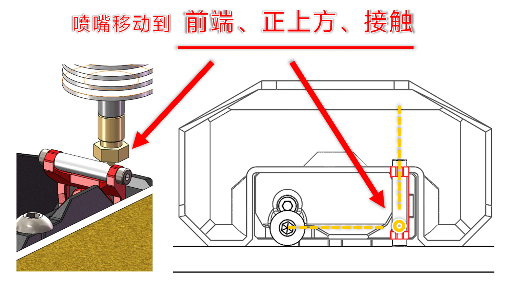

  
     

<h1 align="center">Wipe Nozzle v2</h1>

*
参考Bambu 3D打印机设计的喷嘴擦拭套件
   
  [Nozzle wipe kit designed with reference to Bambu 3D printer]
*

**
**
**<h3 align="center">修改了一下，正在上传……</h3>**
*
反馈意见可以通过[📺BiliBili](https://space.bilibili.com/1898517)私信
*

 ---
 

 
 ---

 ## 目录

- [功能特色](#功能特色)
- [使用提示](#使用提示)
  - [默认安装方式](#默认安装方式)
  - [获取必要参数](#获取必要参数)
- [更新历史](#更新历史)
- [备注](#备注)
  
---

### 功能特色
> - [x] 清洁打印喷嘴
> - [x] 排除热端内余料
> - [x] 多种耗材适用
> - [x] Voron 1 / 2 可用
> - [x] 可换用铜丝刷

### 使用提示

##### 默认安装方式
>  本擦拭套件需要打印机Y轴有至少8mm的空余行程(即在Y轴方向，归零点距离热床边缘大于8mm)，配置文件的默认安装方式如下图（如果安装在其他边或者打印头不是归零到最小值，请自行修改宏文件）
>
   
  
 ##### 获取必要参数
>  将套件固定至热床后，操作喷嘴移动至四氟管的 **前端** 、 **正上方** 、 **并接触** 时，记录X，Y，Z坐标值，填写在 “fz-wipe-nozzle.cfg” 文件对应参数内。
>
   

### 更新历史

> **[Ver 2.0]** 2023.12.13 
> - 修改了擦拭臂结构
> - 修改了固定支架，可以两个维度调节
> - 修改了宏文件，将运行过程分为“粘拭喷嘴”、“排除余料”、“擦拭喷嘴”等几个阶段
> - 增加了 Voron 1 / 2 可用的固定方式

> **[Ver 1.0]** 2023.02.17  
> - 修改了宏文件 —— 加快擦拭速度
> - 修改了介绍文档
 
### 备注
- **参考Bambu 3D打印机设计**

