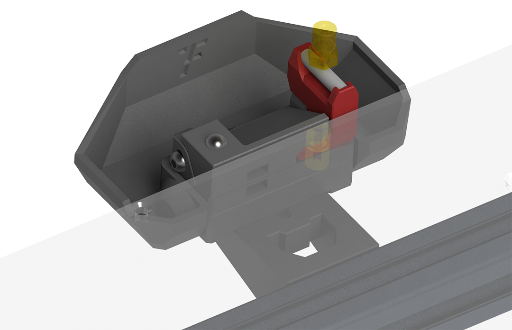

<h1 align="center">Wipe-Nozzle</h1>

**
参考Bambu 3D打印机设计的喷嘴擦拭套件
**

[Nozzle wipe kit designed with reference to Bambu 3D printer]

 ---
 

 
 ---

## 主要特点
> - [x] 保护喷嘴
> - [x] 多种耗材适用
> - [x] 磁吸废料箱
> - [x] 另附铜刷版本

**>****<**
## 更新历史

> **[Ver 1.0]** 2023.02.11  
> - 优化底部2个m3螺丝孔大小
> - 修改了底部的外形

 
## 备注
- 挤出轮臂根据[**`Sherpa mini`**](https://github.com/Annex-Engineering/Sherpa_Mini-Extruder) 修改而来

- **向下/向后** 两种固定方向
 
## 其他

