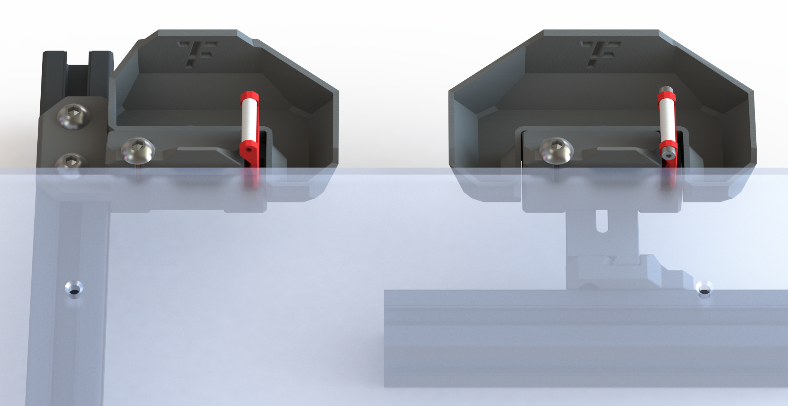

<h1 align="center">Wipe-Nozzle</h1>

**
参考Bambu 3D打印机设计的喷嘴擦拭套件
**

[Nozzle wipe kit designed with reference to Bambu 3D printer]

 ---
 

 
 ---

## 主要特点
> - [x] 保护喷嘴
> - [x] 四氟管耐高温
> - [x] 多种耗材适用
> - [x] 3种磁吸废料箱
> - [x] 另附铜刷版本

**>****<**
## 更新历史

> **[Ver 1.0]** 2023.02.17  
> - 修改了宏文件 —— 加快擦拭速度
> - 修改了介绍文档
 
## 备注
- **参考Bambu 3D打印机设计**
- **四氟管 / 铜刷** 两种清洁方式

